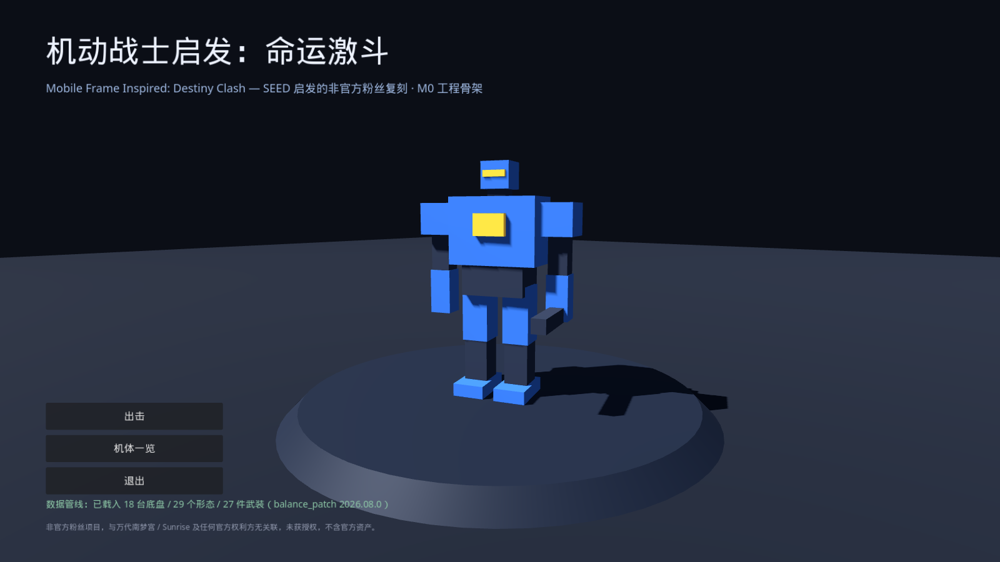
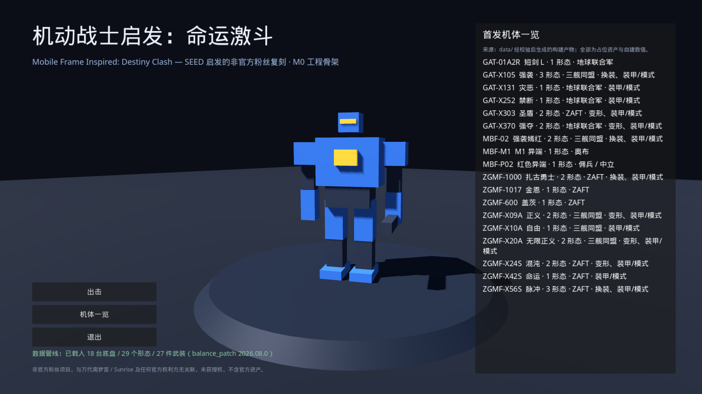

# 机动战士启发：命运激斗

**Mobile Frame Inspired: Destiny Clash** —— 一个 **SEED 启发** 的第三人称锁敌 MS 动作游戏的
**非官方、非商业粉丝复刻项目**。目标平台：**Steam（PC）** 与 **Nintendo Switch**。

> ## 非官方声明
>
> 本项目 **与万代南梦宫娱乐（Bandai Namco Entertainment）、Sunrise、Bandai Namco Forge Digitals
> 及任何官方权利方无关联，未获授权、未获认可**。
>
> 本项目 **不包含也不分发任何官方资产**（模型、贴图、动画、UI 美术、字体、BGM、音效、语音、剧本、数值表），
> 也不包含任何针对原作专有格式的拆包或反编译工具。所有数值均为本项目自建的相对强度设计，
> 所有美术资源均为原创或占位。
>
> 「GUNDAM」「SEED」「BATTLE DESTINY」等为其各自权利方的商标，文档中出现仅用于说明玩法对照关系。
> 详见 [`docs/legal/NOTICE.md`](./docs/legal/NOTICE.md)。

项目采用 **中性粉丝名 + 「SEED 启发」副标题**（REMAKE-PLAN 决策 1 的选项 A）。玩法对照基准是
Steam 正式版 REMASTERED（[AppID 1857740](https://store.steampowered.com/app/1857740/)）**可观测的系统与体验**，
对照仅通过公开资料与合法持有副本的实机观测进行，**不做任何拆包提取**。

## 当前状态：M0（立项基线）

| 交付项 | 状态 |
|--------|------|
| Godot 4 工程骨架，可运行的占位场景 + 标题 UI | ✅ |
| 数据 Schema v1 + 首发 18 台底盘完整条目 | ✅ |
| 数据校验 CLI（Schema + 引用完整性）与 CI 阻断 | ✅ |
| 版权流程初版（LICENSE / NOTICE / 资产登记） | ✅ |
| 战斗、任务、养成玩法 | ⛔ M1 起 |



## 快速开始

```bash
# 1) 校验数据并刷新给引擎用的构建产物
make setup            # 安装 PyYAML / jsonschema（可选，缺失时回退内置校验器）
make validate-data

# 2) 打开游戏工程
#    Godot 4.3+ → 导入 game/project.godot → F5
```

数据校验也可直接运行，退出码 0 表示通过：

```bash
python3 tools/data_validator/validate.py           # 校验
python3 tools/data_validator/validate.py --strict  # Warning 也视为失败
python3 tests/test_data_validator.py               # 校验器自身的反向测试
```

## 仓库结构

```text
├── game/          Godot 4 工程（M0：标题场景 + 原创方块占位机体）
├── data/          YAML 源数据 + JSON Schema（机体 / 形态 / 武装 / 技能 / 驾驶员 / 本地化）
├── tools/         data_validator：Schema 与引用完整性校验 CLI
├── tests/         校验器反向测试
├── platform/      steam / switch 平台适配层占位
└── docs/          方案计划、机体与数据设计、法务 NOTICE
```

## 数据管线

```text
data/**.yaml → 校验（Schema + R-* 引用规则）→ game/data_build/units_index.json → 运行时只读载入
```



M0 数据集：**18 台底盘 / 29 个形态 / 27 件占位武装 / 16 个技能 / 6 个装甲模式 / 5 名原创驾驶员**，
全部 `asset_binding.placeholder = true`。机制覆盖 **换装**（强袭、扎古勇士、脉冲、强袭嫣红）、
**变形**（圣盾、强夺、混沌、正义流星、无限正义）、**装甲/模式**（灾恶、禁断、自由、命运等）。

新增或修改机体时，改 YAML 即可，无需改代码；CI 会阻断引用断裂、Schema 违规与过期构建产物。

## 文档

- [总方案计划（战斗 / 战役 / 架构 / 里程碑 / 版权红线）](./docs/REMAKE-PLAN.md)
- [机体与数据（Schema / 首发名单 / 100+ 路径）](./docs/03-units-and-data.md)
- [数据校验器说明](./tools/data_validator/README.md)
- [Godot 工程说明](./game/README.md)
- [法务 NOTICE 与资产登记](./docs/legal/NOTICE.md)

## 许可证

代码、数据与文档以 [MIT](./LICENSE) 发布。占位资产的许可与来源见 NOTICE 的资产登记表。
